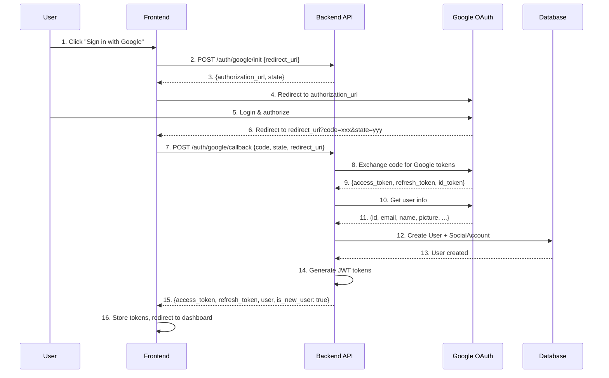
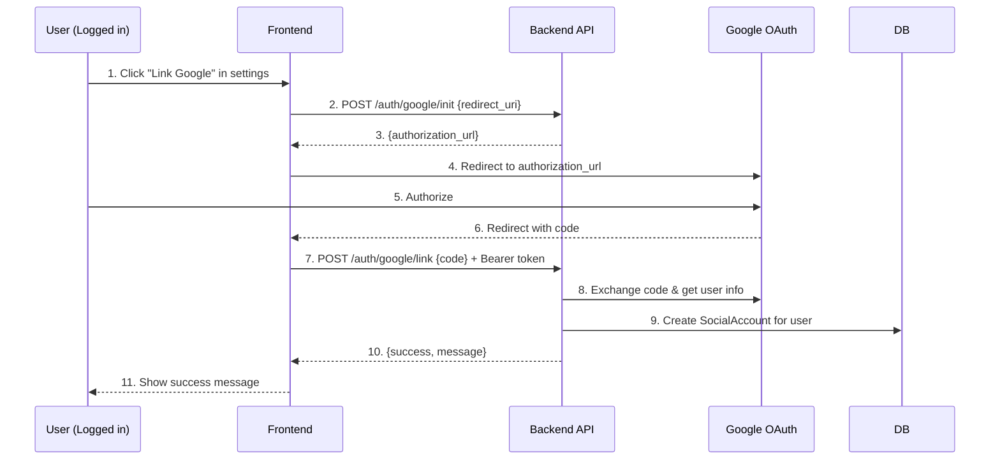

# 🔐 Google OAuth2 Login Documentation

Tài liệu chi tiết về tính năng đăng nhập với Google OAuth2, hỗ trợ custom redirect_uri.

---

## 📋 Mục lục

1. [Tổng quan](#tổng-quan)
2. [Setup Google Console](#setup-google-console)
3. [Cấu hình Backend](#cấu-hình-backend)
4. [API Endpoints](#api-endpoints)
5. [Luồng hoạt động](#luồng-hoạt-động)
6. [Frontend Integration](#frontend-integration)
7. [Database Schema](#database-schema)
8. [Testing](#testing)
9. [Troubleshooting](#troubleshooting)

---

## 🎯 Tổng quan

### Features

✅ **Google OAuth2 Login** - Đăng nhập với tài khoản Google
✅ **Custom redirect_uri** - Linh hoạt cấu hình redirect URL
✅ **Auto Account Creation** - Tự động tạo user khi đăng nhập lần đầu
✅ **Account Linking** - Link Google vào tài khoản hiện có
✅ **Multiple Social Accounts** - Hỗ trợ nhiều phương thức đăng nhập
✅ **Token Management** - Lưu và refresh Google access tokens
✅ **Profile Sync** - Đồng bộ thông tin từ Google profile

### Architecture

```
Frontend → Backend API → Google OAuth → User Creation/Login → JWT Token
```

---

## 🔧 Setup Google Console

### Bước 1: Tạo Google Cloud Project

1. Truy cập [Google Cloud Console](https://console.cloud.google.com/)
2. Tạo project mới hoặc chọn project có sẵn
3. Enable **Google+ API**

### Bước 2: Tạo OAuth 2.0 Credentials

1. Vào **APIs & Services** → **Credentials**
2. Click **Create Credentials** → **OAuth client ID**
3. Chọn **Application type**: **Web application**
4. Đặt tên: "Operis Web App"

### Bước 3: Configure Authorized redirect URIs

**Thêm các redirect URIs:**

```
Development:
- http://localhost:3000/auth/google/callback
- http://localhost:3001/auth/google/callback
- http://127.0.0.1:3000/auth/google/callback

Production:
- https://yourdomain.com/auth/google/callback
- https://app.yourdomain.com/auth/google/callback
```

⚠️ **Quan trọng:** Redirect URI phải khớp chính xác (bao gồm protocol, domain, port, path)

### Bước 4: Lấy Client ID và Client Secret

Sau khi tạo, copy:
- **Client ID**: `xxx.apps.googleusercontent.com`
- **Client Secret**: `GOCSPX-xxx`

---

## ⚙️ Cấu hình Backend

### 1. Install Dependencies

Đã thêm vào `requirements.txt`:
```txt
google-auth==2.25.2
google-auth-oauthlib==1.2.0
requests==2.31.0
```

Rebuild Docker:
```bash
docker-compose down
docker-compose build
docker-compose up -d
```

### 2. Environment Variables

File `.env`:
```env
# Google OAuth2 Settings
GOOGLE_OAUTH_CLIENT_ID=your-client-id.apps.googleusercontent.com
GOOGLE_OAUTH_CLIENT_SECRET=GOCSPX-your-client-secret
GOOGLE_OAUTH_REDIRECT_URI=http://localhost:3000/auth/google/callback
```

⚠️ **Production:** Dùng HTTPS redirect URI

### 3. Settings Configuration

File `config/settings/base.py` đã configured:
```python
GOOGLE_OAUTH_CLIENT_ID = config('GOOGLE_OAUTH_CLIENT_ID', default='')
GOOGLE_OAUTH_CLIENT_SECRET = config('GOOGLE_OAUTH_CLIENT_SECRET', default='')
GOOGLE_OAUTH_REDIRECT_URI = config('GOOGLE_OAUTH_REDIRECT_URI', default='http://localhost:3000/auth/google/callback')
GOOGLE_OAUTH_SCOPES = [
    'openid',
    'https://www.googleapis.com/auth/userinfo.email',
    'https://www.googleapis.com/auth/userinfo.profile',
]
```

---

## 🌐 API Endpoints

**Base URL:** `http://localhost:8001/api/auth/google`

### 1. **POST** `/init` - Get Authorization URL

Bắt đầu OAuth flow, trả về Google authorization URL.

**Request:**
```json
{
  "redirect_uri": "http://localhost:3000/auth/google/callback",  // Optional
  "state": "random-csrf-token"  // Optional
}
```

**Response:**
```json
{
  "authorization_url": "https://accounts.google.com/o/oauth2/v2/auth?client_id=...&redirect_uri=...&scope=...&state=...",
  "state": "random-csrf-token"
}
```

**Usage:**
- Frontend gọi endpoint này
- Nhận authorization_url
- Redirect user tới URL đó
- User đăng nhập Google và authorize

---

### 2. **POST** `/callback` - Exchange Code for Tokens

Xử lý callback từ Google, đổi code lấy JWT tokens.

**Request:**
```json
{
  "code": "4/0AQlEd8...",  // From Google redirect
  "state": "random-csrf-token",  // Optional - for validation
  "redirect_uri": "http://localhost:3000/auth/google/callback"  // Optional - must match init
}
```

**Response:**
```json
{
  "access_token": "eyJhbGciOiJIUzI1NiIs...",  // JWT access token
  "refresh_token": "eyJhbGciOiJIUzI1NiIs...",  // JWT refresh token
  "token_type": "Bearer",
  "user": {
    "id": "uuid",
    "email": "user@gmail.com",
    "full_name": "John Doe",
    "avatar": "https://lh3.googleusercontent.com/...",
    "role": "customer",
    ...
  },
  "is_new_user": true,  // Newly created account
  "social_account_created": true  // New social link
}
```

---

### 3. **POST** `/link` 🔒 - Link Google to Existing Account

Link Google account vào user đã authenticated.

**Authentication:** Required (Bearer token)

**Request:**
```json
{
  "code": "4/0AQlEd8...",
  "redirect_uri": "http://localhost:3000/auth/google/callback"
}
```

**Response:**
```json
{
  "success": true,
  "message": "Google account linked successfully",
  "provider": "google",
  "provider_user_id": "1234567890",
  "email": "user@gmail.com"
}
```

**Use case:**
- User đã có account (email/password)
- Muốn thêm "Sign in with Google"
- Call `/init` → User authorize → Call `/link` với code

---

### 4. **POST** `/unlink` 🔒 - Unlink Social Account

Xóa liên kết social account.

**Authentication:** Required

**Request:**
```json
{
  "provider": "google"
}
```

**Response:**
```json
{
  "success": true,
  "message": "Google account unlinked successfully"
}
```

**Validations:**
- Không thể unlink nếu là phương thức đăng nhập duy nhất
- User phải có password hoặc social account khác

---

### 5. **GET** `/accounts` 🔒 - List Social Accounts

Danh sách social accounts của user.

**Authentication:** Required

**Response:**
```json
[
  {
    "provider": "google",
    "provider_user_id": "1234567890",
    "email": "user@gmail.com",
    "is_primary": true,
    "last_login_at": "2025-01-21T12:00:00Z",
    "created_at": "2025-01-15T10:30:00Z"
  }
]
```

---

## 🔄 Luồng hoạt động

### Flow 1: Đăng nhập với Google (User mới)



### Flow 2: Đăng nhập với Google (User đã tồn tại)

- Tương tự Flow 1, nhưng:
- Step 12: Tìm thấy user theo email → Link SocialAccount
- Response: `is_new_user: false, social_account_created: true/false`

### Flow 3: Link Google vào account hiện có



---

## 💻 Frontend Integration

### React/Next.js Example

#### 1. Google Login Button

```tsx
// components/GoogleLoginButton.tsx
import { useState } from 'react';
import { useRouter } from 'next/navigation';

export default function GoogleLoginButton() {
  const router = useRouter();
  const [loading, setLoading] = useState(false);

  const handleGoogleLogin = async () => {
    try {
      setLoading(true);

      // Step 1: Get authorization URL
      const initResponse = await fetch('/api/auth/google/init', {
        method: 'POST',
        headers: { 'Content-Type': 'application/json' },
        body: JSON.stringify({
          redirect_uri: `${window.location.origin}/auth/google/callback`
        })
      });

      const { authorization_url, state } = await initResponse.json();

      // Step 2: Store state for validation
      sessionStorage.setItem('google_oauth_state', state);

      // Step 3: Redirect to Google
      window.location.href = authorization_url;

    } catch (error) {
      console.error('Google login failed:', error);
      setLoading(false);
    }
  };

  return (
    <button
      onClick={handleGoogleLogin}
      disabled={loading}
      className="google-login-btn"
    >
      {loading ? 'Redirecting...' : 'Sign in with Google'}
    </button>
  );
}
```

#### 2. Callback Page

```tsx
// app/auth/google/callback/page.tsx
'use client';

import { useEffect } from 'react';
import { useRouter, useSearchParams } from 'next/navigation';

export default function GoogleCallbackPage() {
  const router = useRouter();
  const searchParams = useSearchParams();

  useEffect(() => {
    const handleCallback = async () => {
      // Step 1: Get code and state from URL
      const code = searchParams.get('code');
      const state = searchParams.get('state');

      if (!code) {
        router.push('/login?error=no_code');
        return;
      }

      // Step 2: Validate state (CSRF protection)
      const storedState = sessionStorage.getItem('google_oauth_state');
      if (state !== storedState) {
        console.error('State mismatch - possible CSRF attack');
        router.push('/login?error=invalid_state');
        return;
      }

      try {
        // Step 3: Exchange code for tokens
        const response = await fetch('/api/auth/google/callback', {
          method: 'POST',
          headers: { 'Content-Type': 'application/json' },
          body: JSON.stringify({
            code,
            state,
            redirect_uri: `${window.location.origin}/auth/google/callback`
          })
        });

        const data = await response.json();

        if (!response.ok) {
          throw new Error(data.message || 'Authentication failed');
        }

        // Step 4: Store tokens
        localStorage.setItem('access_token', data.access_token);
        localStorage.setItem('refresh_token', data.refresh_token);
        localStorage.setItem('user', JSON.stringify(data.user));

        // Step 5: Clean up
        sessionStorage.removeItem('google_oauth_state');

        // Step 6: Redirect to dashboard
        router.push('/dashboard');

      } catch (error) {
        console.error('Callback failed:', error);
        router.push('/login?error=callback_failed');
      }
    };

    handleCallback();
  }, [searchParams, router]);

  return (
    <div className="flex items-center justify-center min-h-screen">
      <div className="text-center">
        <div className="spinner"></div>
        <p>Completing sign in with Google...</p>
      </div>
    </div>
  );
}
```

#### 3. Link Google Account (Settings Page)

```tsx
// components/LinkGoogleAccount.tsx
'use client';

export default function LinkGoogleAccount() {
  const [loading, setLoading] = useState(false);
  const [linkedAccounts, setLinkedAccounts] = useState([]);

  useEffect(() => {
    fetchLinkedAccounts();
  }, []);

  const fetchLinkedAccounts = async () => {
    const token = localStorage.getItem('access_token');
    const response = await fetch('/api/auth/google/accounts', {
      headers: { 'Authorization': `Bearer ${token}` }
    });
    const accounts = await response.json();
    setLinkedAccounts(accounts);
  };

  const handleLinkGoogle = async () => {
    // Similar to login, but call /link endpoint
    // ...
  };

  const handleUnlink = async (provider) => {
    const token = localStorage.getItem('access_token');
    await fetch('/api/auth/google/unlink', {
      method: 'POST',
      headers: {
        'Content-Type': 'application/json',
        'Authorization': `Bearer ${token}`
      },
      body: JSON.stringify({ provider })
    });
    fetchLinkedAccounts();
  };

  return (
    <div>
      <h2>Connected Accounts</h2>
      {linkedAccounts.map(account => (
        <div key={account.provider}>
          <span>{account.provider}: {account.email}</span>
          <button onClick={() => handleUnlink(account.provider)}>
            Unlink
          </button>
        </div>
      ))}
      <button onClick={handleLinkGoogle}>Link Google Account</button>
    </div>
  );
}
```

---

## 💾 Database Schema

### SocialAccount Model

```sql
CREATE TABLE social_accounts (
    id UUID PRIMARY KEY,
    user_id UUID NOT NULL REFERENCES users(id) ON DELETE CASCADE,
    provider VARCHAR(50) NOT NULL,  -- 'google', 'facebook', etc.
    provider_user_id VARCHAR(255) NOT NULL,  -- Google user ID
    access_token TEXT NOT NULL,  -- Google access token
    refresh_token TEXT NULL,  -- Google refresh token
    token_expires_at TIMESTAMP NULL,
    profile_data JSONB DEFAULT '{}',  -- Cached Google profile
    email VARCHAR(255) NOT NULL,
    is_primary BOOLEAN DEFAULT FALSE,
    last_login_at TIMESTAMP NULL,
    created_at TIMESTAMP NOT NULL DEFAULT NOW(),
    updated_at TIMESTAMP NOT NULL DEFAULT NOW(),

    UNIQUE(provider, provider_user_id)
);

CREATE INDEX idx_social_user_provider ON social_accounts(user_id, provider);
CREATE INDEX idx_social_provider_uid ON social_accounts(provider, provider_user_id);
CREATE INDEX idx_social_email ON social_accounts(email);
```

---

## 🧪 Testing

### Manual Testing

```bash
# 1. Run migrations
docker-compose exec backend python manage.py makemigrations
docker-compose exec backend python manage.py migrate

# 2. Check API docs
open http://localhost:8001/api/docs

# 3. Test init endpoint
curl -X POST http://localhost:8001/api/auth/google/init \
  -H "Content-Type: application/json" \
  -d '{"redirect_uri": "http://localhost:3000/auth/google/callback"}'

# Response should contain authorization_url
```

### Integration Test Flow

1. Call `/init` → Get authorization_url
2. Open authorization_url in browser
3. Login with Google test account
4. Copy code from redirect URL
5. Call `/callback` with code
6. Verify JWT tokens returned
7. Use access_token to call authenticated endpoints

---

## 🔧 Troubleshooting

### Error: redirect_uri_mismatch

**Nguyên nhân:** Redirect URI không khớp với Google Console

**Giải pháp:**
1. Check redirect_uri trong request
2. Verify redirect_uri trong Google Console
3. Đảm bảo match chính xác (http vs https, port, path)

### Error: invalid_grant

**Nguyên nhân:** Authorization code đã được sử dụng hoặc expired

**Giải pháp:**
- Code chỉ dùng được 1 lần
- Phải exchange code ngay sau khi nhận
- Nếu lỗi, bắt đầu lại từ `/init`

### Error: Google account already linked to another user

**Nguyên nhân:** Google account đã link với user khác

**Giải pháp:**
- User cần unlink từ account cũ
- Hoặc login với account đó

### Email không match

**Tình huống:** User có account với email A, login Google với email B

**Hành vi:**
- Tạo user mới với email B
- Không tự động merge accounts

**Giải pháp:**
- Use `/link` endpoint để link Google vào account hiện có
- Hoặc thêm logic merge accounts

---

## 📚 Tài liệu tham khảo

- [Google OAuth2 Documentation](https://developers.google.com/identity/protocols/oauth2)
- [Google Cloud Console](https://console.cloud.google.com/)
- [OAuth 2.0 Security Best Practices](https://datatracker.ietf.org/doc/html/draft-ietf-oauth-security-topics)

---

**© 2025 Operis - Google OAuth2 Integration**
