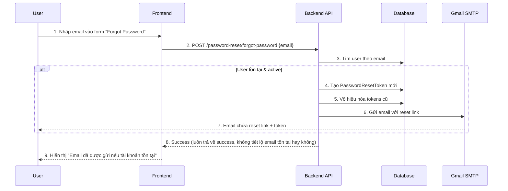
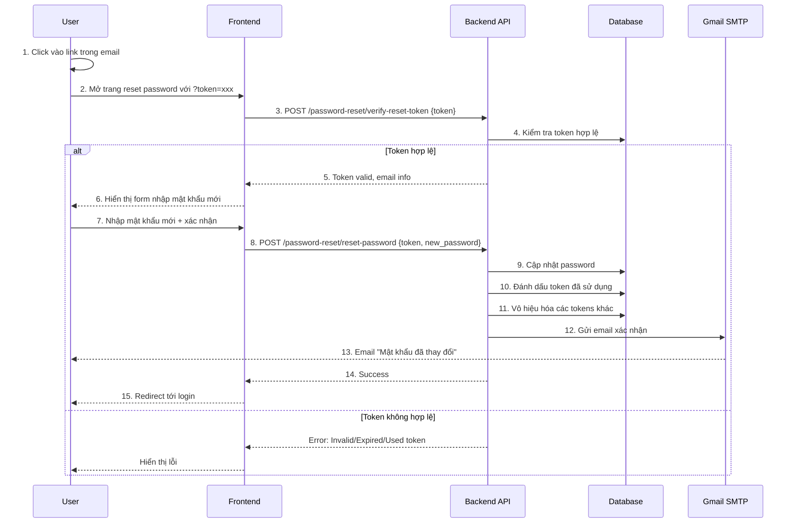
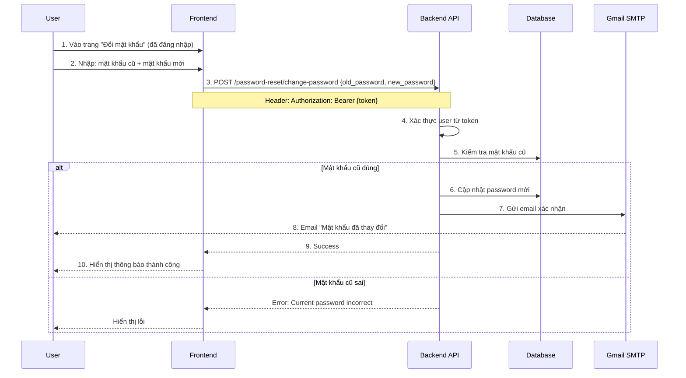

# 🔐 Password Reset & Forgot Password Documentation

Tài liệu chi tiết về tính năng Quên mật khẩu, Đổi mật khẩu và Xác thực Email sử dụng Gmail SMTP.

---

## 📋 Mục lục

1. [Tổng quan](#tổng-quan)
2. [Kiến trúc hệ thống](#kiến-trúc-hệ-thống)
3. [Cấu hình](#cấu-hình)
4. [Luồng hoạt động](#luồng-hoạt-động)
5. [API Endpoints](#api-endpoints)
6. [Database Schema](#database-schema)
7. [Email Templates](#email-templates)
8. [Bảo mật](#bảo-mật)
9. [Testing](#testing)
10. [Troubleshooting](#troubleshooting)

---

## 🎯 Tổng quan

Hệ thống Password Reset cung cấp các tính năng:

✅ **Forgot Password** - Yêu cầu đặt lại mật khẩu qua email
✅ **Reset Password** - Đặt lại mật khẩu với token hợp lệ
✅ **Change Password** - Đổi mật khẩu cho user đã đăng nhập
✅ **Email Verification** - Gửi email xác thực qua Gmail SMTP
✅ **Token Security** - Token bảo mật với thời gian hết hạn
✅ **Beautiful Email Templates** - Email HTML responsive đẹp mắt

---

## 🏗️ Kiến trúc hệ thống

### Components

```
📁 backend/
├── 📁 apps/users/
│   ├── 📁 models/
│   │   ├── user.py                          # User model
│   │   └── password_reset_token.py          # Token model (NEW)
│   ├── 📁 services/
│   │   ├── auth_service.py                  # Authentication logic
│   │   └── password_reset_service.py        # Password reset logic (NEW)
│   ├── 📁 schemas/
│   │   ├── user_schema.py                   # User schemas
│   │   └── password_reset_schema.py         # Password reset schemas (NEW)
│   ├── 📁 routers/
│   │   ├── auth_router.py                   # Auth endpoints
│   │   └── password_reset_router.py         # Password reset endpoints (NEW)
│   └── 📁 templates/emails/
│       ├── password_reset.html              # Reset email template (NEW)
│       └── password_changed.html            # Confirmation email (NEW)
├── 📁 config/settings/
│   └── base.py                              # Email & settings config (UPDATED)
└── .env.example                              # Environment variables (UPDATED)
```

### Database Models

```python
# PasswordResetToken Model
- id: UUID (Primary Key)
- user: ForeignKey(User)
- token: CharField(100) - Unique, Indexed
- expires_at: DateTimeField
- used_at: DateTimeField (nullable)
- ip_address: GenericIPAddressField (nullable)
- user_agent: CharField(500) (nullable)
- created_at: DateTimeField (auto)
- updated_at: DateTimeField (auto)
```

---

## ⚙️ Cấu hình

### 1. Email Settings (Gmail SMTP)

Thêm vào file `.env`:

```env
# Email Settings (Gmail SMTP)
EMAIL_BACKEND=django.core.mail.backends.smtp.EmailBackend
EMAIL_HOST=smtp.gmail.com
EMAIL_PORT=587
EMAIL_USE_TLS=True
EMAIL_HOST_USER=your-email@gmail.com
EMAIL_HOST_PASSWORD=your-app-password-here
DEFAULT_FROM_EMAIL=noreply@operis.vn

# Frontend URL (for reset password links)
FRONTEND_URL=http://localhost:3000
```

### 2. Tạo App Password cho Gmail

**Bước 1:** Đăng nhập vào tài khoản Google
**Bước 2:** Truy cập [https://myaccount.google.com/security](https://myaccount.google.com/security)
**Bước 3:** Bật **2-Step Verification** (bắt buộc)
**Bước 4:** Truy cập **App Passwords**: [https://myaccount.google.com/apppasswords](https://myaccount.google.com/apppasswords)
**Bước 5:** Chọn **Mail** và **Other (Custom name)**
**Bước 6:** Đặt tên: "Operis Backend"
**Bước 7:** Copy **App Password** (16 ký tự) và paste vào `EMAIL_HOST_PASSWORD`

⚠️ **Lưu ý:** Không sử dụng password Gmail thường, phải dùng App Password!

### 3. Settings Configuration

File `config/settings/base.py` đã được cấu hình:

```python
# Email Settings
EMAIL_BACKEND = config('EMAIL_BACKEND', default='django.core.mail.backends.smtp.EmailBackend')
EMAIL_HOST = config('EMAIL_HOST', default='smtp.gmail.com')
EMAIL_PORT = config('EMAIL_PORT', default=587, cast=int)
EMAIL_USE_TLS = config('EMAIL_USE_TLS', default=True, cast=bool)
EMAIL_HOST_USER = config('EMAIL_HOST_USER', default='')
EMAIL_HOST_PASSWORD = config('EMAIL_HOST_PASSWORD', default='')
DEFAULT_FROM_EMAIL = config('DEFAULT_FROM_EMAIL', default='noreply@operis.vn')
SERVER_EMAIL = DEFAULT_FROM_EMAIL

# Password Reset Settings
PASSWORD_RESET_TIMEOUT = 60 * 30  # 30 minutes
FRONTEND_URL = config('FRONTEND_URL', default='http://localhost:3000')
```

### 4. Development Mode (Console Email)

Để test không cần Gmail, dùng console backend:

```env
EMAIL_BACKEND=django.core.mail.backends.console.EmailBackend
```

Email sẽ hiển thị trong terminal thay vì gửi thật.

---

## 🔄 Luồng hoạt động

### Flow 1: Forgot Password (Quên mật khẩu)



### Flow 2: Reset Password (Đặt lại mật khẩu)



### Flow 3: Change Password (Đổi mật khẩu - User đã login)



---

## 🌐 API Endpoints

### Base URL
```
http://localhost:8000/api/password-reset
```

---

### 1. **POST** `/forgot-password`

Yêu cầu đặt lại mật khẩu qua email.

**Request:**
```json
{
  "email": "user@example.com"
}
```

**Response:** (200 OK)
```json
{
  "success": true,
  "message": "If the email exists, a password reset link has been sent"
}
```

**Lưu ý:** Luôn trả về success (bảo mật - không tiết lộ email có tồn tại hay không)

---

### 2. **POST** `/verify-reset-token`

Kiểm tra token reset có hợp lệ không.

**Request:**
```json
{
  "token": "abcdef123456..."
}
```

**Response:** (200 OK)
```json
{
  "valid": true,
  "message": "Token is valid",
  "email": "user@example.com",
  "expires_in_minutes": 25
}
```

**Error Response:** (400 Bad Request)
```json
{
  "detail": "Invalid or expired reset token"
}
```

---

### 3. **POST** `/reset-password`

Đặt lại mật khẩu với token hợp lệ.

**Request:**
```json
{
  "token": "abcdef123456...",
  "new_password": "NewPass123",
  "confirm_password": "NewPass123"
}
```

**Password Requirements:**
- Tối thiểu 8 ký tự
- Ít nhất 1 chữ cái
- Ít nhất 1 số

**Response:** (200 OK)
```json
{
  "success": true,
  "message": "Password has been reset successfully"
}
```

**Error Responses:**
- Token invalid/expired/used: `400 Bad Request`
- Password too weak: `422 Unprocessable Entity`
- Passwords don't match: `422 Unprocessable Entity`

---

### 4. **POST** `/change-password` 🔒

Đổi mật khẩu cho user đã đăng nhập.

**Authentication Required:** Bearer Token

**Headers:**
```
Authorization: Bearer <access_token>
```

**Request:**
```json
{
  "old_password": "OldPass123",
  "new_password": "NewPass456",
  "confirm_password": "NewPass456"
}
```

**Response:** (200 OK)
```json
{
  "success": true,
  "message": "Password has been changed successfully"
}
```

**Error Responses:**
- Unauthorized: `401 Unauthorized`
- Wrong old password: `400 Bad Request`
- Passwords don't match: `422 Unprocessable Entity`

---

## 💾 Database Schema

### PasswordResetToken Model

```sql
CREATE TABLE password_reset_tokens (
    id UUID PRIMARY KEY,
    user_id UUID NOT NULL REFERENCES users(id) ON DELETE CASCADE,
    token VARCHAR(100) UNIQUE NOT NULL,
    expires_at TIMESTAMP NOT NULL,
    used_at TIMESTAMP NULL,
    ip_address INET NULL,
    user_agent VARCHAR(500) NULL,
    created_at TIMESTAMP NOT NULL DEFAULT NOW(),
    updated_at TIMESTAMP NOT NULL DEFAULT NOW()
);

CREATE INDEX idx_token_expires ON password_reset_tokens(token, expires_at);
CREATE INDEX idx_user_created ON password_reset_tokens(user_id, created_at);
```

### Indexes

- **token + expires_at**: Fast lookup khi verify token
- **user_id + created_at**: Fast query để lấy tokens của user

### Cleanup Strategy

Token tự động hết hạn sau 30 phút. Có thể dùng periodic task để cleanup:

```python
# Management command hoặc Celery task
from apps.users.services.password_reset_service import PasswordResetService

service = PasswordResetService()
deleted_count = service.cleanup_expired_tokens()
```

---

## 📧 Email Templates

### 1. Password Reset Email

**Template:** `apps/users/templates/emails/password_reset.html`

**Features:**
- ✅ Responsive design (mobile + desktop)
- ✅ Gradient header đẹp mắt
- ✅ Nút "Đặt lại mật khẩu" nổi bật
- ✅ Thông báo thời gian hết hạn
- ✅ Alternative link (nếu button không hoạt động)
- ✅ Security notice
- ✅ Professional footer

**Context Variables:**
```python
{
    'user': User object,
    'reset_url': 'http://localhost:3000/reset-password?token=xxx',
    'expiry_minutes': 30,
    'site_name': 'Operis',
    'support_email': 'noreply@operis.vn'
}
```

### 2. Password Changed Confirmation

**Template:** `apps/users/templates/emails/password_changed.html`

**Features:**
- ✅ Success confirmation với icon ✅
- ✅ Security alert nếu không phải user thực hiện
- ✅ Nút "Liên hệ hỗ trợ"
- ✅ Security tips
- ✅ Professional design

**Context Variables:**
```python
{
    'user': User object,
    'site_name': 'Operis',
    'support_email': 'noreply@operis.vn'
}
```

---

## 🔒 Bảo mật

### Token Security

1. **Secure Token Generation**
   ```python
   import secrets
   token = secrets.token_urlsafe(32)  # 256-bit entropy
   ```

2. **Token Expiration**: 30 phút (configurable)

3. **Single Use**: Token chỉ dùng được 1 lần, sau đó mark as `used_at`

4. **Auto Invalidation**: Khi tạo token mới, tất cả tokens cũ bị vô hiệu hóa

5. **Database Index**: Fast lookup với indexed token field

### Email Security

1. **Generic Messages**: Không tiết lộ email có tồn tại hay không
2. **Rate Limiting**: Nên implement để tránh spam (TODO)
3. **IP & User Agent Logging**: Track nguồn gốc request

### Password Requirements

```python
# Validation rules
- Minimum 8 characters
- At least 1 letter (A-Z, a-z)
- At least 1 number (0-9)
```

Có thể tăng cường thêm:
- Ký tự đặc biệt
- Uppercase + lowercase
- Password strength meter

### Best Practices

✅ **DO:**
- Sử dụng HTTPS trong production
- Set secure email config
- Log password reset attempts
- Implement rate limiting
- Monitor suspicious activities

❌ **DON'T:**
- Expose whether email exists
- Allow unlimited reset requests
- Store tokens in plain text (đã hash UUID)
- Send passwords in email
- Use short token expiration

---

## 🧪 Testing

### Manual Testing

#### 1. Test Forgot Password Flow

```bash
# 1. Request password reset
curl -X POST http://localhost:8000/api/password-reset/forgot-password \
  -H "Content-Type: application/json" \
  -d '{"email": "test@example.com"}'

# 2. Check email (console or inbox)
# Copy token from reset URL

# 3. Verify token
curl -X POST http://localhost:8000/api/password-reset/verify-reset-token \
  -H "Content-Type: application/json" \
  -d '{"token": "YOUR_TOKEN_HERE"}'

# 4. Reset password
curl -X POST http://localhost:8000/api/password-reset/reset-password \
  -H "Content-Type: application/json" \
  -d '{
    "token": "YOUR_TOKEN_HERE",
    "new_password": "NewPass123",
    "confirm_password": "NewPass123"
  }'
```

#### 2. Test Change Password Flow

```bash
# 1. Login to get token
curl -X POST http://localhost:8000/api/auth/login \
  -H "Content-Type: application/json" \
  -d '{
    "email": "test@example.com",
    "password": "NewPass123"
  }'

# 2. Change password (with access_token)
curl -X POST http://localhost:8000/api/password-reset/change-password \
  -H "Content-Type: application/json" \
  -H "Authorization: Bearer YOUR_ACCESS_TOKEN" \
  -d '{
    "old_password": "NewPass123",
    "new_password": "NewPass456",
    "confirm_password": "NewPass456"
  }'
```

### Test Cases Checklist

- [ ] ✅ Forgot password với email tồn tại
- [ ] ✅ Forgot password với email không tồn tại (vẫn success)
- [ ] ✅ Verify token hợp lệ
- [ ] ✅ Verify token đã hết hạn
- [ ] ✅ Verify token đã sử dụng
- [ ] ✅ Reset password thành công
- [ ] ✅ Reset password với mật khẩu yếu (validation error)
- [ ] ✅ Reset password với confirm không khớp
- [ ] ✅ Change password với old password đúng
- [ ] ✅ Change password với old password sai
- [ ] ✅ Email được gửi đúng template
- [ ] ✅ Token bị vô hiệu sau khi reset

---

## 🔧 Troubleshooting

### Vấn đề 1: Email không được gửi

**Triệu chứng:** API success nhưng không nhận được email

**Giải pháp:**

1. Kiểm tra Gmail App Password:
   ```bash
   # Test SMTP connection
   python manage.py shell
   >>> from django.core.mail import send_mail
   >>> send_mail('Test', 'Body', 'from@gmail.com', ['to@email.com'])
   ```

2. Kiểm tra settings:
   ```python
   # In Django shell
   from django.conf import settings
   print(settings.EMAIL_HOST)
   print(settings.EMAIL_HOST_USER)
   print(settings.EMAIL_USE_TLS)
   ```

3. Check Gmail security:
   - 2-Step Verification enabled?
   - App Password correct?
   - Less secure app access (legacy)?

4. Check spam folder

### Vấn đề 2: Token không hợp lệ

**Triệu chứng:** "Invalid or expired reset token"

**Nguyên nhân:**
- Token đã hết hạn (>30 phút)
- Token đã được sử dụng
- Token không tồn tại trong database

**Giải pháp:**
```python
# Check trong Django shell
from apps.users.models import PasswordResetToken
token_obj = PasswordResetToken.objects.get(token='YOUR_TOKEN')
print(f"Valid: {token_obj.is_valid()}")
print(f"Expired: {token_obj.is_expired}")
print(f"Used: {token_obj.is_used}")
print(f"Time remaining: {token_obj.time_remaining}")
```

### Vấn đề 3: Migration errors

**Triệu chứng:** Migration fails

**Giải pháp:**
```bash
# Create migration
python manage.py makemigrations users

# Check migration
python manage.py showmigrations users

# Apply migration
python manage.py migrate users

# If stuck, try:
python manage.py migrate users --fake-initial
```

### Vấn đề 4: Template not found

**Triệu chứng:** "TemplateDoesNotExist: emails/password_reset.html"

**Giải pháp:**

1. Kiểm tra TEMPLATES DIRS trong settings:
   ```python
   TEMPLATES[0]['DIRS'] = [BASE_DIR / 'apps' / 'users' / 'templates']
   ```

2. Kiểm tra file tồn tại:
   ```bash
   ls -la backend/apps/users/templates/emails/
   ```

3. Service có fallback email nếu template không tồn tại

---

## 📝 Changelog

### Version 1.0.0 (2025-01-21)

**Added:**
- ✅ PasswordResetToken model
- ✅ PasswordResetService với đầy đủ logic
- ✅ 4 API endpoints (forgot, verify, reset, change)
- ✅ Pydantic schemas với validation
- ✅ Beautiful HTML email templates (responsive)
- ✅ Gmail SMTP configuration
- ✅ Security features (token expiry, single-use, etc.)
- ✅ Comprehensive documentation

**Security:**
- ✅ 256-bit secure token generation
- ✅ Token expiration (30 minutes)
- ✅ Single-use tokens
- ✅ IP & User Agent logging
- ✅ Password strength validation
- ✅ Generic success messages (security)

---

## 🎓 Tài liệu tham khảo

- [Django Email Documentation](https://docs.djangoproject.com/en/5.0/topics/email/)
- [Gmail SMTP Settings](https://support.google.com/mail/answer/7126229)
- [Google App Passwords](https://support.google.com/accounts/answer/185833)
- [Django Password Validation](https://docs.djangoproject.com/en/5.0/topics/auth/passwords/)
- [Python Secrets Module](https://docs.python.org/3/library/secrets.html)

---

## 👥 Support

Nếu gặp vấn đề, liên hệ:

📧 Email: noreply@operis.vn
📱 Team: Operis Development Team
📚 Docs: `PASSWORD_RESET_README.md`

---

**© 2025 Operis. All rights reserved.**
